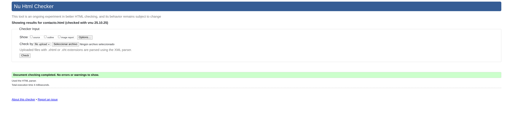
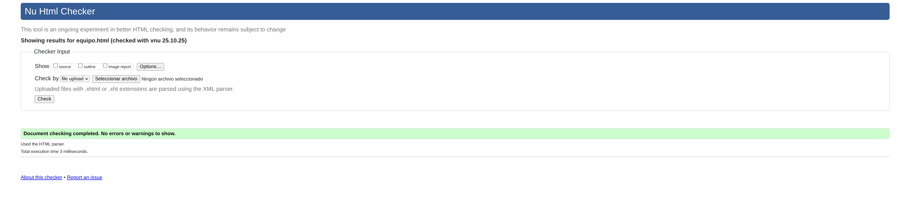
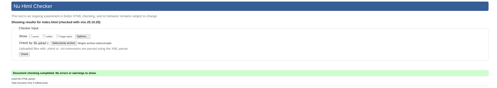

## **Descripción del proyecto**

Web de un medio de prensa especializado en videojuegos completamente ficticio llamado BurninGames, a través del cual intento emular el funcionamiento real de un medio de este tipo (noticias reales, abiertos a colaboradores, pestaña de foro comunitario...)

---
## **Estructura**
Como elementos comunes a todas las páginas tenemos un `<header>` y un `<footer>`, el `<header>` consta de 3 `<section>`:

- **Navegar a,** que contiene el `<nav>` con todos los apartados de la página contenidos en un `<ul>` 
- **Búsqueda,** que contiene la barra de búsqueda, envuelta en un `<search>` , además de un enlace abajo para suscribirse a la newsletter
-  **Contacto y RRSS**, que contiene las redes sociales y un enlace al formulario de contacto

En el `<footer>` encontramos un `<address>` con las redes sociales, además de un apartado de aviso legal y un párrafo con el copyright
### **Index**
La página principal. Como contenido principal tiene una **sección de artículos**, (ya que estos serían los elementos de interés para la mayoría de usuarios)
dividida en dos subsecciones (Últimas noticias y Más relevantes) delimitadas por su correspondiente `<section>` . Cada una de estas subsecciones tiene un `<article>` correspondiente a una noticia/artículo, a su vez dividido en un `<header>` para el titular y la foto y fuera de este un `<p>` a modo de resumen de la noticia
### **Equipo**
Contiene un `<section>` con foto, nombre y cargo de todos los miembros del equipo, cada uno en un `<article>` y de forma aislada, un enlace para colaborar 
## **Foro**
Contiene 2 `<section>`, uno con mensajes destacados y otro con los recientes
 En cada `<section>` hay un mensaje, pero ambos con la misma estructura (un `<article>` que contiene un `<header>` con el nombre de usuario, foto de perfil y fecha de publicación y fuera del `<header>` el propio mensaje)
 Abajo del todo, hay un formulario con un `<textarea>` a modo de barra de comentarios.
Además uno de los mensajes contiene un `<table>`comparativo entre 2 consolas
### **Contacto**
Contiene 2 `<section>`, uno con el formulario de contacto (formulario con varios `<input>` para los datos, un `<select>` para el motivo de contacto y `<textarea>` para el mensaje) y otro para el formulario de la newsletter, que solo es un `<input>` que pide el email

### **Lanzamientos**
Contiene 2 `<section>`,  uno con los juegos lanzados recientemente y otro con los que llegarán próximamente, cada juego es un `<article>` que contiene una imagen de la portada, nombre en `<h3>` y un parrafo con las plataformas en las que está disponible + la fecha de salida en caso de los próximos

### **Artículo**
`<article>` que contiene un `<header>` con `<h1>` a modo de titular, `<h2>` como subtitulo, foto relacionada con la noticia, foto y nombre del redactor, además de la fecha de publicación. El cuerpo del artículo es un párrafo con `<br>` para saltos de línea y `<strong>`para destacar la información relevante .

--- 
## **Justificación de las decisiones**
Cada `<section>` representa una sección con sentido por si misma dentro de la página y, de igual forma los `<article>` dentro de estas representan elementos con sentido por si mismos

Algunos `<article>` tienen `<header>` ya que considero hay una separación evidente entre el cuerpo y el resto del mensaje (por ejemplo entre la cabecera de los articulos del index y su resumen, o en el foro entre los propios mensajes y la información del usuario y publicación)

Los `<address>` están establecidos de manera que engloban los métodos de contacto (considerando las redes sociales como parte de estos)

Los `<h1>` señalan cual es el contenido principal de la página, los `<h2>` representan las subsecciones dentro de este contenido principal, y `<h3>` escontenido del que deriva otro dentro de esas subsecciones  (titulos de los juegos, de los que deriva su fecha, nombres de usuario de los que deriva su mensaje...)

El `<table>` del foro está puesto debido a que estamos comparando datos

Por último, los `<textarea>` están pensados para mensajes que pueden extenderse mucho (como los comentarios del foro)

--- 
## **Validaciones**







---

## **Estrategia CSS: Arquitectura y Estilizado**

Para el diseño y la apariencia de BurninGames, he adoptado un enfoque basado en **variables CSS personalizadas** y una **metodología BEM** simplificada. Esto me permite mantener un tema coherente en todo el sitio, facilita la creación de un modo oscuro y asegura que los estilos sean mantenibles y escalables.

### **Variables CSS y Temático**

El corazón del sistema de estilos reside en la pseudo-clase `:root`, donde se definen las variables de color. Esto me permite tener una paleta centralizada que se aplica a todos los elementos.

```css
:root {
  --color-primario: #fdf0d5;
  --color-secundario: #c1121f;
  --color-terciario: #003049;
  --color-clickable: #ff70a6;
  --color-letras: #000;
  /* ... más variables */
}
```

La gestión del tema (claro/oscuro) se maneja de forma muy eficiente gracias a estas variables. Al cambiar una clase en el elemento `<body>`, simplemente redefinimos los valores de las variables. El resto del CSS no necesita saber qué tema está activo, solo usa las variables.

```css
body.modo__oscuro {
  --color-secundario: #000;
  --color-letras: #fff;
  --color-primario: #212529;
  /* ... nuevos valores para el modo oscuro */
}
```

Además, he incluido una consulta `@media (prefers-color-scheme: dark)` para respetar la preferencia de tema del sistema operativo del usuario por defecto, ofreciendo una experiencia de navegación más personalizada desde el primer momento.

### **Metodología de Nomenclatura (BEM)**

Para evitar conflictos de estilos y crear bloques de código autocontenidos y reutilizables, he utilizado una convención de nomenclatura inspirada en **BEM (Bloque, Elemento, Modificador)**.

*   **Bloque**: Entidad independiente (ej. `cabecera`, `juego`, `formulario`).
*   **Elemento**: Parte de un bloque que no tiene significado por sí solo (ej. `cabecera__logo`, `juego__fecha`, `formulario__campo`).
*   **Modificador**: Una variante o estado diferente de un bloque o elemento (ej. `cabecera--semitransparente`, `boton-desactivado`).

Esta nomenclatura hace que el HTML y el CSS sean mucho más legibles y fáciles de depurar, ya que la relación entre los elementos es explícita.

### **Diseño con Grid y Flexbox**

Combino **CSS Grid** y **Flexbox** para crear layouts responsivos y adaptables.
*   **Grid** se utiliza para estructuras de dos dimensiones, como las cuadrículas de juegos en la página de Lanzamientos (`.seccion__recientes`) o los miembros del equipo (`.seccion__nuestroequipo`).
*   **Flexbox** es mi herramienta principal para componentes de una sola dimensión, como la disposición de los elementos en la cabecera (`.cabecera__menu__lista`), los artículos de noticias (`.noticia`) o los formularios en pantallas pequeñas.

### **Estados y Microinteracciones**

Las interacciones del usuario se realzan mediante pseudo-clases como `:hover`.
*   Los elementos clickables (juegos, noticias, botones) tienen transiciones suaves que modifican propiedades como `transform` (escala o desplazamiento) y `box-shadow`, dando una sensación táctil y dinámica.
*   El equipo tiene una animación de "salto" al pasar el ratón, añadiendo un toque de personalidad y diversión a la página.
*   Para los mensajes del foro que pueden ser "eliminables", uso un pseudo-elemento `::before` que crea una superposición semitransparente al hacer hover, indicando visualmente una acción destructiva sin necesidad de JavaScript.

### **Diseño Responsive**

El sitio está diseñado para verse correctamente en una amplia gama de dispositivos, desde móviles hasta monitores de escritorio. Utilizo **media queries** para ajustar el layout en puntos de ruptura clave.
*   **`max-width: 820px`**: En tablets, las cuadrículas de juegos y noticias se apilan en una sola columna para facilitar la lectura en vertical.
*   **`max-width: 579px`**: En móviles, los formularios se reorganizan en columna y los menús se adaptan, mostrando un botón de menú hamburguesa.
*   **`(prefers-reduced-motion: reduce)`**: Respeto las preferencias de accesibilidad del usuario, eliminando todas las animaciones y transiciones si el sistema operativo tiene activada la opción de reducir el movimiento.

### **Accesibilidad**

Además de respetar `prefers-reduced-motion`, me he asegurado de que los colores tengan suficiente contraste (especialmente en el tema oscuro) y que los elementos interactivos tengan un estado `:hover` claro. El uso semántico de HTML (como `<header>`, `<nav>`, `<main>`, `<article>`) también contribuye a una mejor accesibilidad para lectores de pantalla.

---

## **Validación y Pruebas**

He sometido el CSS al validador de W3C para asegurar que la sintaxis es correcta y no contiene errores. Todas las pruebas han pasado con éxito, garantizando un código limpio y conforme a los estándares.

