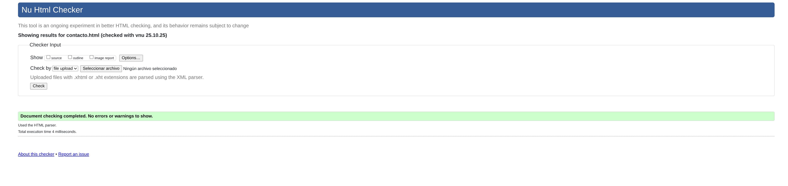
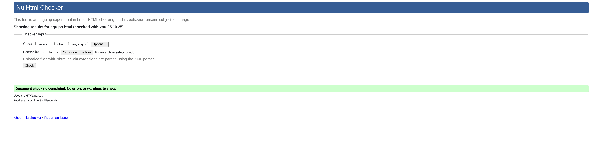
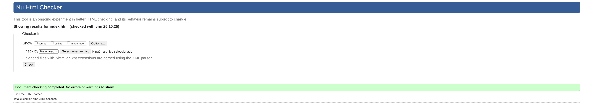

## **Descripción del proyecto**

Web de un medio de prensa especializado en videojuegos completamente ficticio llamado BurninGames, a través del cual intento emular el funcionamiento real de un medio de este tipo (noticias reales, abiertos a colaboradores, pestaña de foro comunitario...)

---
## **Estructura**
Como elementos comunes a todas las páginas tenemos un `<header>` y un `<footer>`, el `<header>` consta de 3 `<section>`:

- **Navegar a,** que contiene el `<nav>` con todos los apartados de la página contenidos en un `<ul>` 
- **Búsqueda,** que contiene la barra de búsqueda, envuelta en un `<search>` , además de un enlace abajo para suscribirse a la newsletter
-  **Contacto y RRSS**, que contiene las redes sociales y un enlace al formulario de contacto

En el `<footer>` encontramos un `<address>` con las redes sociales, además de un apartado de aviso legal y un párrafo con el copyright
### **Index**
La página principal. Como contenido principal tiene una **sección de artículos**, (ya que estos serían los elementos de interés para la mayoría de usuarios)
dividida en dos subsecciones (Últimas noticias y Más relevantes) delimitadas por su correspondiente `<section>` . Cada una de estas subsecciones tiene un `<article>` correspondiente a una noticia/artículo, a su vez dividido en un `<header>` para el titular y la foto y fuera de este un `
` a modo de resumen de la noticia
### **Equipo**
Contiene un `<section>` con foto, nombre y cargo de todos los miembros del equipo, cada uno en un `<article>` y de forma aislada, un enlace para colaborar 
## **Foro**
Contiene 2 `<section>`, uno con mensajes destacados y otro con los recientes
 En cada `<section>` hay un mensaje, pero ambos con la misma estructura (un `<article>` que contiene un `<header>` con el nombre de usuario, foto de perfil y fecha de publicación y fuera del `<header>` el propio mensaje)
 Abajo del todo, hay un formulario con un `<textarea>` a modo de barra de comentarios.
Además uno de los mensajes contiene un `<table>`comparativo entre 2 consolas
### **Contacto**
Contiene 2 `<section>`, uno con el formulario de contacto (formulario con varios `<input>` para los datos, un `<select>` para el motivo de contacto y `<textarea>` para el mensaje) y otro para el formulario de la newsletter, que solo es un `<input>` que pide el email

### **Lanzamientos**
Contiene 2 `<section>`,  uno con los juegos lanzados recientemente y otro con los que llegarán próximamente, cada juego es un `<article>` que contiene una imagen de la portada, nombre en `<h3>` y un parrafo con las plataformas en las que está disponible + la fecha de salida en caso de los próximos

### **Artículo**
`<article>` que contiene un `<header>` con `<h1>` a modo de titular, `<h2>` como subtitulo, foto relacionada con la noticia, foto y nombre del redactor, además de la fecha de publicación. El cuerpo del artículo es un párrafo con ` ` para saltos de línea y `<strong>`para destacar la información relevante .

--- 
## **Justificación de las decisiones**
Cada `<section>` representa una sección con sentido por si misma dentro de la página y, de igual forma los `<article>` dentro de estas representan elementos con sentido por si mismos

Algunos `<article>` tienen `<header>` ya que considero hay una separación evidente entre el cuerpo y el resto del mensaje (por ejemplo entre la cabecera de los articulos del index y su resumen, o en el foro entre los propios mensajes y la información del usuario y publicación)

Los `<address>` están establecidos de manera que engloban los métodos de contacto (considerando las redes sociales como parte de estos)

Los `<h1>` señalan cual es el contenido principal de la página, los `<h2>` representan las subsecciones dentro de este contenido principal, y `<h3>` escontenido del que deriva otro dentro de esas subsecciones  (titulos de los juegos, de los que deriva su fecha, nombres de usuario de los que deriva su mensaje...)

El `<table>` del foro está puesto debido a que estamos comparando datos

Por último, los `<textarea>` están pensados para mensajes que pueden extenderse mucho (como los comentarios del foro)

--- 
## **Validaciones**

